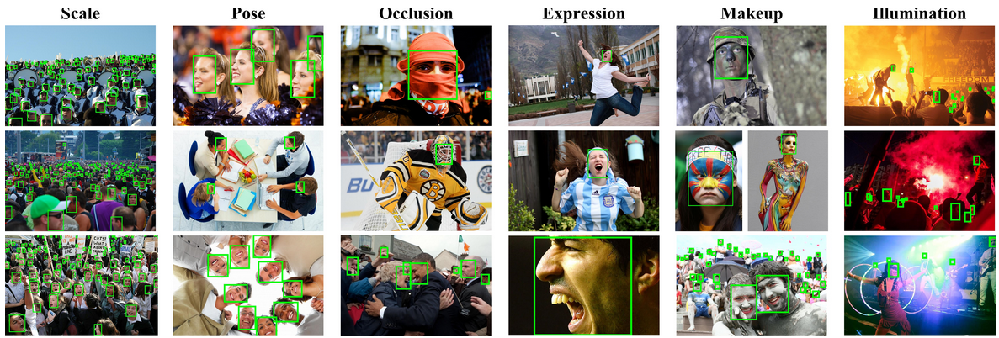
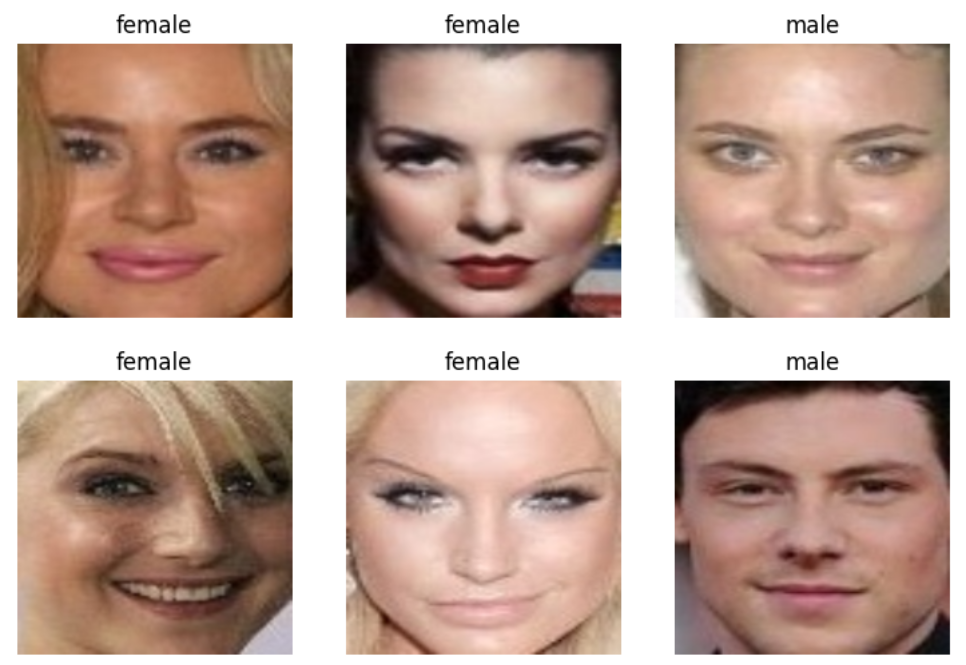
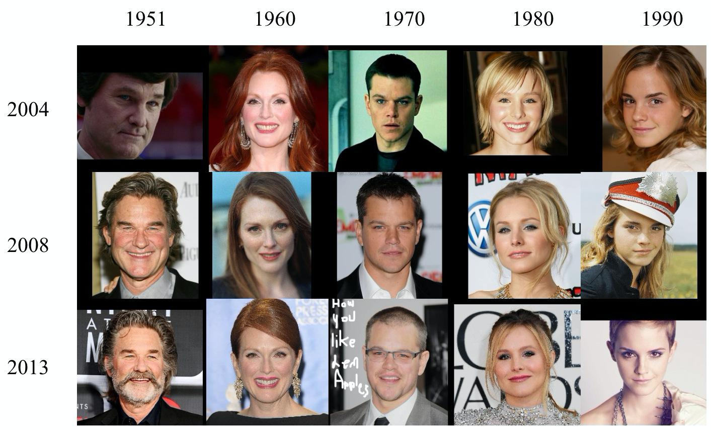
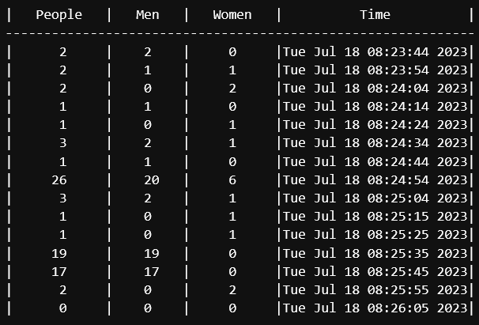

[](https://colab.research.google.com/drive/17ABFzyQRVFIqw1iXJbUcFg5CfD7wUvYd#scrollTo=QT3HLw6QWaPd)

# Smart audience

A smart audience project controls the audience in a university, school or office. It can process information about whether pupil, student or employee in the audience are at work, how long they have worked, their age and gender.

For this we trained three models using [yolov8](https://github.com/ultralytics/ultralytics) and pytorch library. You can find face detection source code from [this](https://github.com/shoxa0707/Deploy-yolov8-model-in-different-modules). And you can train age and gender models in **train models.ipynb** notebook.

## Datasets

1. For face detection [wider face](http://shuoyang1213.me/WIDERFACE/) dataset is used.<br>

<a></a>

2. For gender classification [gender](https://www.kaggle.com/datasets/cashutosh/gender-classification-dataset) dataset is used. Clean this dataset before you use it. Because it contains many errors.

<a></a>

3. For age classification [age](https://paperswithcode.com/dataset/cacd) dataset is used.

<a></a>

# Installation

- install torch

if GPU is available(for CUDA=11.7 in my PC):
```
pip install torch==2.0.0+cu117 torchvision==0.15.1+cu117 torchaudio==2.0.1 --index-url https://download.pytorch.org/whl/cu117
```
else:
```
pip install torch==2.0.0 torchvision==0.15.1 torchaudio==2.0.1
```
- install other necessary libraries

```
pip install -r requirements.txt
```

# Deployments

## python console code

```
python run.py -v path/to/your/video -m path/to/trained/models -s path/to/save/result/video/in/mp4 -t time-to-save-database
```
As a result, a video is created and the obtained data is stored in database. The database is stored as follows:

<a></a>

To check this, type the following code into the terminal:
```
python check_database.py
```
## Streamlit

```
streamlit run stream.py
```


